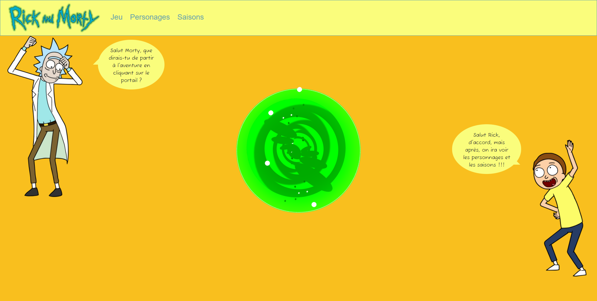

# Rick-And-Morty

## Table of contents

* What is Rick-And-Morty ?
* How does it work ?
* Stack

### What is Rick-And-Morty ?

Rick-And-Morty is a personnal project. You can find all seasons, all characters and a little game.

### How does it work ?

When you're on home page, you can click on the portal to play a game.

The game consists of answering whether the character presented is dead or alive. You've got 5 lives at the begining and you score 100 points per good answer.

You can also view all the characters in the series by going to the characters section.

You can consult all seaons and all episodes within a season.

Enjoy your Rick-And-Morty.

[https://seb-rick-and-morty.netlify.app](https://seb-rick-and-morty.netlify.app)

### Stack

#### API

Rick and Morty API  
The Movie Database API
